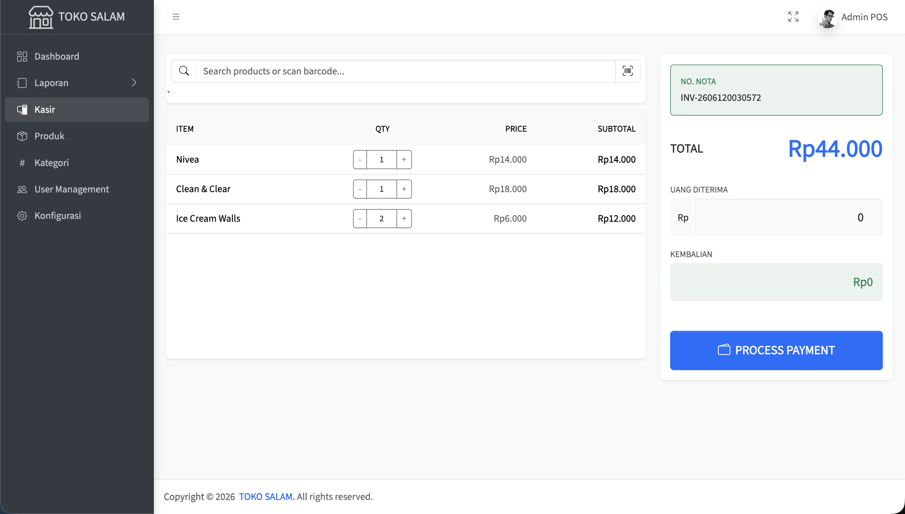

# Project Title

A brief description of what this project does and who it's for

# POS Toko Salam

Aplikasi Point of Sales (POS) untuk Toko Salam, dibangun menggunakan framework Laravel.

## 📁 Struktur Direktori (Tree View)

Berikut adalah penjelasan struktur utama folder dalam proyek Laravel ini:

```text
pos-toko-salam/
├── app/                  ## Logika inti aplikasi (Models, |Controllers, Middleware)
├── app/Http/Controllers/ ## Logika Bisnis / Backend
├── app/Http/Request      ## Definisi format permintaan (Validasi Input)  
├── bootstrap/            # File untuk inisialisasi aplikasi
├── config/               # Semua file konfigurasi aplikasi (database, mail, dll)
├── database/             ## File migration, seeder, dan factories untuk struktur database
├── public/               ## File publik (index.php, CSS terkompilasi, JS, gambar)
├── resources/            ## Tampilan antarmuka (views/Blade), raw aset (CSS/JS)
├── routes/               ## Definisi rute URL aplikasi (web.php, api.php)
├── storage/              # Tempat penyimpanan file upload, log aplikasi, dan cache
├── tests/                # Folder untuk pengujian kode otomatis (testing)
├── vendor/               # Dependensi/library PHP dari Composer
├── .env                  ## File konfigurasi environment utama (kredensial DB)
├── artisan               # Command-line interface Laravel
├── composer.json         # Daftar dependensi PHP
├── package.json          # Daftar dependensi frontend (Node.js/NPM)
└── vite.config.js        # Konfigurasi build aset frontend
```

## 📸 Preview Proyek
### Halaman Kasir / Transaksi


---

## 🚀 Panduan Menjalankan Proyek di Lokal

Ikuti langkah-langkah di bawah ini untuk menginstal dan menjalankan proyek di komputer Anda.

### Persyaratan Sistem
Pastikan Anda sudah menginstal:
- PHP >= 8.5.5
- Composer ^2.9.5
- Database server (contoh: MySQL / MariaDB via XAMPP/Herd)

### 1. Install Dependensi (Composer)
Buka terminal/command prompt, pastikan Anda berada di direktori proyek (`pos-toko-salam`), lalu jalankan:
```bash
composer install
```
*Perintah ini akan mengunduh semua library PHP yang diperlukan proyek.*

### 2. Konfigurasi Environment (`.env`)
Salin file konfigurasi bawaan dan hasilkan kunci aplikasi (App Key):
```bash
cp .env.example .env
php artisan key:generate
```
**Penting:** Buka file `.env` dan atur koneksi database Anda. Contoh untuk MySQL:
```env
DB_CONNECTION=mysql
DB_HOST=127.0.0.1
DB_PORT=3306
DB_DATABASE=pos_toko_salam
DB_USERNAME=root
DB_PASSWORD=
```
*(Pastikan Anda sudah membuat database kosong bernama `pos_toko_salam` di MySQL)*

### 3. Migrate dan Seeding Database
Jalankan perintah ini untuk membuat semua tabel di database dan mengisi data awal (seeding) seperti akun admin default:
```bash
php artisan migrate --seed
```
### 4. Running Proyek (Menjalankan Server)
Untuk menjalankan aplikasi, Anda perlu membuka **dua tab terminal** secara bersamaan:

**Terminal 1 (Server Backend / Laravel):**
```bash
php artisan serve
```

Aplikasi sekarang dapat diakses melalui browser pada alamat:
👉 **[http://localhost:8000](http://localhost:8000)**

---

## 📝 Mengedit / Membaca README dengan Readme.so

File `README.md` ini dapat dibaca atau diedit dengan lebih interaktif menggunakan [readme.so](https://readme.so/):
1. Buka situs **[readme.so/editor](https://readme.so/editor)** di browser Anda.
2. Salin (copy) seluruh isi kode/teks dari file `README.md` ini.
3. Tempel (paste) kode tersebut ke dalam area editor di `readme.so`.
4. Anda dapat melihat *live preview* hasilnya secara langsung di layar sebelah kanan, dan dapat mengedit isi dokumentasi dengan lebih mudah.

---

## 💳 Testing Pembayaran Midtrans (Sandbox)

Proyek ini terintegrasi dengan gateway pembayaran Midtrans (mode sandbox/testing). Untuk melakukan simulasi pembayaran (seperti Virtual Account, Kartu Kredit, dll), Midtrans menyediakan kredensial khusus untuk testing.

Silakan merujuk pada dokumentasi resmi Midtrans untuk melihat daftar nomor Virtual Account, Kartu Kredit, dan metode lainnya yang bisa digunakan untuk testing:
👉 **[Testing Payment on Sandbox - Midtrans](https://docs.midtrans.com/docs/testing-payment-on-sandbox)**
